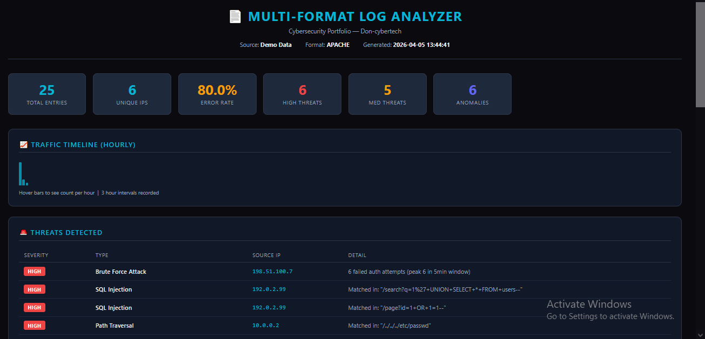
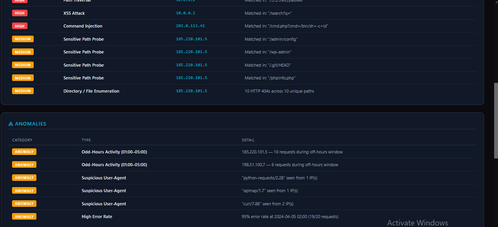
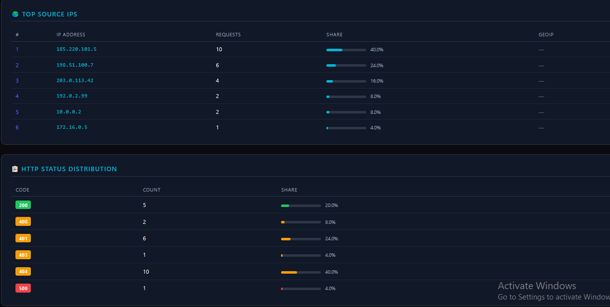

# 📄 Multi-Format Log Analyzer v1.0


A cybersecurity portfolio project that parses and analyzes multiple log formats to detect threats, anomalies, and suspicious activity — with GeoIP enrichment and a dark-themed HTML report.

---

## 🔍 Features

- **Multi-Format Parsing** — Auto-detects Apache/Nginx, Syslog/Auth, Windows Event, and JSON logs
- **Threat Detection** — Identifies Brute Force, SQL Injection, XSS, Path Traversal, LFI, Command Injection, Directory Enumeration, and Scanner activity
- **Anomaly Detection** — Flags traffic spikes, off-hours activity, suspicious user-agents, and high error rates
- **GeoIP Lookup** — Enriches top source IPs with country, city, and organization data
- **Dark HTML Report** — Generates a professional dark-themed report with traffic timeline, threat table, and IP breakdown
- **Real-Time Monitoring** — Watches a live log file and alerts on new threats as they appear
- **Zero External Dependencies** — Built entirely with Python standard library

---

## 🛡️ Threat Detection Coverage

| Threat Type              | Severity | Detection Method                          |
|--------------------------|----------|-------------------------------------------|
| Brute Force Attack       | HIGH     | 5+ failed auths in a 5-minute window      |
| SQL Injection            | HIGH     | UNION SELECT, OR 1=1, DROP TABLE patterns |
| XSS Attack               | HIGH     | `<script>`, `onerror=`, `alert()` patterns|
| Path Traversal           | HIGH     | `../`, URL-encoded variants               |
| LFI Attempt              | HIGH     | `/etc/passwd`, `win.ini`, `/proc/self`    |
| Command Injection        | HIGH     | `/bin/sh`, `cmd.exe`, `powershell`        |
| Directory Enumeration    | MEDIUM   | 10+ HTTP 404s from a single IP            |
| Scanner Detected         | MEDIUM   | sqlmap, nikto, gobuster, nmap signatures  |
| Sensitive Path Probe     | MEDIUM   | `.env`, `.git/HEAD`, `phpinfo`, `wp-admin`|

---

## 📸 Screenshots

### HTML Report — Overview & Threats


### HTML Report — Anomalies & IP Breakdown


### HTML Report — Status Codes & Timeline


---

## 🚀 Usage

### Run Demo Mode
```bash
python log_analyzer.py --demo
```

### Analyze a Log File
```bash
python log_analyzer.py --file access.log
```

### Generate HTML Report
```bash
python log_analyzer.py --file access.log --report report.html
```

### GeoIP Enrichment
```bash
python log_analyzer.py --file access.log --geoip
```

### Real-Time Monitoring
```bash
python log_analyzer.py --file auth.log --watch
```

### All Options Combined
```bash
python log_analyzer.py --file access.log --geoip --report report.html
```

---

## 📁 Project Structure

```
multi-format-log-analyzer/
├── log_analyzer.py        # Main script
├── README.md              # Project documentation
└── screenshots/
    ├── screenshot1.png    # HTML report - overview & threats
    ├── screenshot2.png    # HTML report - anomalies & IPs
    └── screenshot3.png    # HTML report - status codes & timeline
```

---

## ⚙️ Requirements

- Python 3.7+
- No external libraries required
- Internet connection only needed for `--geoip` flag (uses ip-api.com)

---

## 🧠 Concepts Demonstrated

- Regex-based log parsing and format auto-detection
- Sliding window algorithm for brute force detection
- Pattern matching for OWASP Top 10 attack signatures
- Statistical anomaly detection (spike multiplier, error rate analysis)
- REST API consumption via `urllib` (GeoIP)
- Multithreading for real-time file monitoring
- HTML report generation with inline CSS

---

## 👤 Author

**Don-cybertech**  
Cybersecurity Portfolio — [github.com/Don-cybertech](https://github.com/Don-cybertech)
